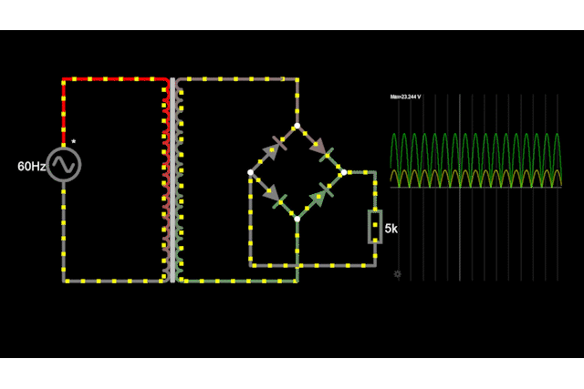
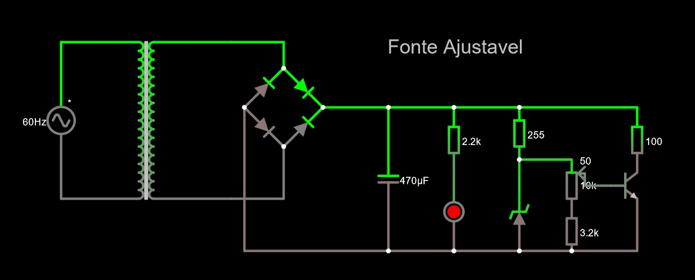
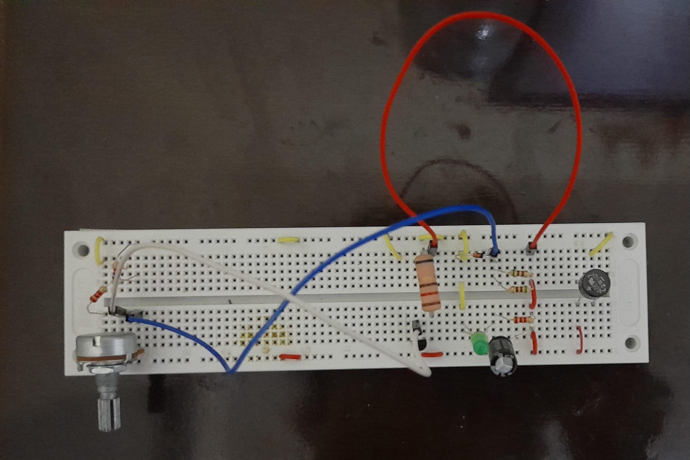
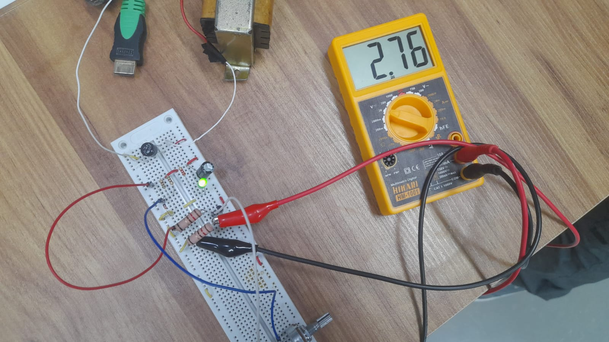
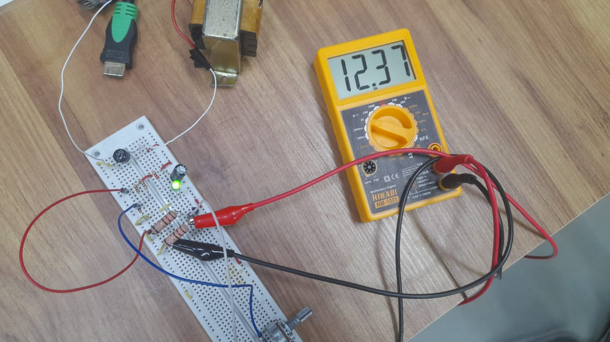

# Fonte de tensão ajustável (3V-12V)

A fonte de tensão é um circuito que transforma a corrente alternada para continua com os parametros de uma corrente efetiva de 100mA e voltagem variando de 3V até 12V.

# Componentes

## Transformador

O transformador é a parte inicial do circuito. Ele, neste circuito, é resposavel por diminuir a tensão que recebemos da tomada para um valor que possamos trabalhar com.
Sabendo que, em teoria, a tensão RMS (root mean square) no Brasil é 127V temos:

$RMS = \frac{Vpico}{\sqrt{2}}$

$127V = \frac{Vpico}{\sqrt{2}}$

$Vpico = 127 \cdot \sqrt{2} \approx 179.605$

Durante as aulas medimos a tensão dos transformadores, obtendo para o utilizado uma tensão de aproximadamente 24.2V.
Sabendo que a proporção de espiras é dado por:

$Prop = \frac{VpicoAntes}{VpicoDepois}$

$Prop = \frac{179.6}{24.2} \approx 7.42$

Dessa forma obtendo as especificações do transformador utilizado.

## Ponte retificadora completa

A ponte retificadora completa é uma configuração de 4 diodos que utilizamos para direcionar a tensão vinda do transformador para um unica direção do circuito.

O circuito sem a ponte funcionaria polarizado de duas formas por um periodo a tensão vai na direção "positiva" e outra na "negativa".

Agora quando usamos a ponte retificadora temos que independente da direção da corrente alternada ela sempre caminhara pelo caminho que desejamos. Pois quando positivo, a tensão vem da parte de cima, o diodo da esquerda inibe que ele va pela esquerda e direciona para a direita, quando negativo, a tensão vem pela parte de baixo sobre a mesma lógica.

É notavel que na ponte retificadora completa existe uma queda de tensão pois um diodo de silicio dissipa uma tensão de aproximadamente 0.7V.

Eu escolhi uma ponte retifacdora ja pré preparada com o nome Ponte Retificadora 2W10 pois era a mais conveniente de se colocar no circuito.

## Capacitor 

O capacitor é o componente responsavel por alisar os picos das curvas da tensão que chega ao circuito. Ele armazena uma quantidade de carga quando o circuito é ligado e quando atinge carga maxima é descarregado em uma velocidade alta.

Esse comportamento resulta que a forma das ondas de tensão no circuito se tornão cada vez mais lineares aproximando, quanto maior for o valor do capacitor, uma linha horizontal.

O capacitor foi calculado com a seguinte formula:

$C = \frac{Icarga}{2 \cdot ƒ \cdot Vripple}$

Em que C é a capacitâcia, $Icarga$ é a corrente maxima que tera na carga, ƒ é a frequencia da onda e $Vripple$ o maximo de tensão que o circuito ainda pode alternar periodicamente.

Sabendo que $Icarga$ é 100mA ƒ é 60Hz e $Vripple$ eu escolhi 2V temos:

$C = \frac{100 \cdot 10^{-3}}{2 \cdot 60 \cdot 2} = 416uF$

Como esse capacitor não é comercialmente vendido eu optei por um maior de 470uF para calcular o ripple que esse novo capacitor ira gerar temos a seguinte formula:

$Vripple = \frac{Icarga}{2 \cdot ƒ \cdot 470 \cdot 10^{-6}} \approx 1.77$

A razão pela qual eu escolhi uma capcitância pequena, que leva a um ripple maior, é que o custo de um capacito maior é significamente superior ao de um menor que ja atenderia as especificções da fonte.

## Custo dos componentes

| Componente               | Preço   |
|--------------------------|---------|
| Ponte Retificadora 2W10  | R$ 1.10 |
| Capacitor de 470uF/25V   | R$ 0.65 |
| 2*Resistor de 2K2        | R$ 0.16 |
| LED verde                | R$ 0.50 |
| 2*Resitor de 510R (1/4)W | R$ 0.14 | 
| Diodo Zener 13V (1/2)W   | R$ 0.70 |
| Potenciômetro 10k linear | R$ 7.00 |
| Resistor de 1k (1/4)W    | R$ 0.07 |
| Resitor de 120R 5W       | R$ 1.40 |
| BC548B                   | R$ 0.30 |

Total = R$ 14.16

Obs: Preço considerando o valor unitario de cada um dos componentes

## Circuito no Falstad

<a href="https://tinyurl.com/2fhaega6">

Link para o circuito: https://tinyurl.com/2fhaega6

## Circuito Montado

Uma imagem do circuito de uma visão por cima:

Imagens do circuito com uma resistencia de 120Ohms como teste:

## Esquemático da PCB no EAGLE

## PCB no EAGLE

## Feito por:

Vinícius Souza Freitas - 15491959

## Agradecimentos

Profesor Simões, que encotrou o problema quase instantaneamente enquanto eu e o kaita ficamos umas 3 horas tentando encontra-lo.

Jonas Kaita, um dos maiores cozinheiros.
