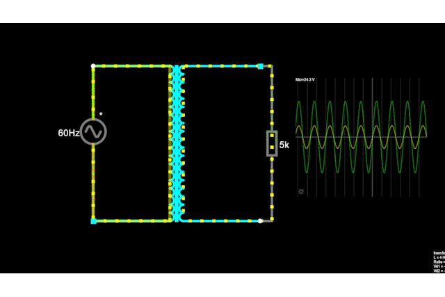

# Fonte de tensão ajustável (3V-12V)

A fonte de tensão é um circuito que transforma a corrente alternada para continua com os parametros de uma corrente efetiva de 100mA e voltagem variando de 3V até 12V.

# Componentes

## Transformador

O transformador é a parte inicial do circuito. Ele, neste circuito, é resposavel por diminuir a tensão que recebemos da tomada para um valor que possamos trabalhar com.
Sabendo que, em teoria, a tensão RMS (root mean square) no Brasil é 127V temos:

$RMS = \frac{Vpico}{\sqrt{2}}$

$127V = \frac{Vpico}{\sqrt{2}}$

$Vpico = 127 \cdot \sqrt{2} \approx 179.605$

Durante as aulas medimos a tensão dos transformadores, obtendo para o utilizado uma tensão de aproximadamente 24.2V após ser retificado, o que siginifica que passou por um diodo e, portanto, teve um queda de tensão de 0.7V logo o valor após o transformador é 24.9V.
Sabendo que a proporção de espiras é dado por:

$Prop = \frac{VpicoAntes}{VpicoDepois}$

$Prop = \frac{179.6}{24.9} \approx 7.21$

Dessa forma obtendo as especificações do transformador utilizado.

## Ponte retificadora completa

A ponte retificadora completa é uma configuração de 4 diodos que utilizamos para direcionar a tensão vinda do transformador para um unica direção do circuito.

O circuito sem a ponte funcionaria polarizado de duas formas por um periodo a tensão vai na direção "positiva" e outra na "negativa".

Agora quando usamos a ponte retificadora temos que independente da direção da corrente alternada ela sempre caminhara pelo caminho que desejamos. Pois quando positivo, a tensão vem da parte de cima, o diodo da esquerda inibe que ele va pela esquerda e direciona para a direita, quando negativo, a tensão vem pela parte de baixo sobre a mesma lógica.

É notavel que na ponte retificadora completa existe uma queda de tensão pois um diodo de silicio dissipa uma tensão de aproximadamente 0.7V portanto no circuito teremos cerca de 23V.

Eu escolhi uma ponte retifacdora ja pré preparada com o nome Ponte Retificadora 2W10 pois era a mais conveniente de se colocar no circuito.

## Capacitor 

O capacitor é o componente responsavel por alisar os picos das curvas da tensão que chega ao circuito. Ele armazena uma quantidade de carga quando o circuito é ligado e quando atinge carga maxima é descarregado em uma velocidade alta.

Esse comportamento resulta que a forma das ondas de tensão no circuito se tornão cada vez mais lineares aproximando, quanto maior for o valor do capacitor, uma linha horizontal.

O capacitor foi calculado com a seguinte formula:

$C = \frac{Icarga}{2 \cdot ƒ \cdot Vripple}$

Em que C é a capacitâcia, $Imax$ é a corrente maxima que tera na carga, ƒ é a frequencia da onda e $Vripple$ o maximo de tensão que o circuito ainda pode alternar periodicamente.

Calculando $Imax$

$Iled = \frac{24.2-0.7}{2200} \approx 11mA$

$Izener = \frac{24.2-13}{255} \approx 44mA$

O $Icarga$ pode ser aproximado como $100mA$

$Itotal = 11mA + 44mA + 100mA = 155mA$

Sabendo que $Imax$ é 155mA ƒ é 120Hz e $Vripple$ sera no minimo 10% da tensão que tera no capacitor que é aproximadamente 2.42V. Eu escolhi 2V porque é um pouco a baixo de 10% e simplifica as contas, com isso temos:

$C = \frac{100 \cdot 10^{-3}}{2 \cdot 120 \cdot 2} = 322uF$

Como esse capacitor não é comercialmente e eu também queria um ripple minimo na minha fonte eu optei por um de 470uF que possui valor um pouco maior e faz com que o ripple seja menor que 10%, além de funcionar como uma rede de segurança para que tenha certeza que a fonte atinja o maximo constantemente.

$Vripple = \frac{Icarga}{2 \cdot ƒ \cdot 470 \cdot 10^{-6}} \approx 1.37V$

## Diodo Zener

O diodo zener é o componente responsavel por limitar a tensão que chega aos terminais da fonte, funcionando também como um aparato de segurança para ela.

Ele funciona da seguinte forma, quando a tensão esta indo do anodo cátodo ele funciona como um diodo comum permitindo a passagem de corrente e dissipando cerca de 0.7V da tensão.

Agora, quando ele esta conectado do cátodo para o anodo, sua funcionalidade muda para que exista tensão de corte do zener ($Vz$). Para qualquer valor de tensão menor que $Vz$ o zener funcionara como curto porém para tensões maiores que $Vz$ o diodo entrara na região de corte.

Na região de corte temos que o zener tera uma voltagem negativa praticamente constante de $Vz$ que limitara a tensão a este valor.

Quando no estado de corte o zener utilizara a corrente maxima para dissipar $Vz$ da seguinte forma:

$\frac{Pz}{Vz} = Imax$

Em que $Pz$ é a potência do zener.

Um zener ideal poderia ter por ele uma corrente infinita. Um zener real dissipando mais que sua potência ira queimar por isso é necessario que seja inserindo um resistor em serie ($Rs$) ao zener para limitar a corrente que passa por ele, obtendo a seguinte relação:

$Rmin = \frac{Vs - Vz}{Imax}$ 

Em que $Vs$ é a voltagem provida pela fonte

No meu circuito eu escolhi um diodo zener de 13V e 0.5W (pois era o que tinha na loja) obtendo os seguintes calculos:

$Imax = \frac{0.5}{13} \approx 38.4mA$

Mesmo no circuito tendo um ripple de $\approx 1.77V$ ainda é seguro utilizar o $Vs maximo$ para o minimo pois sera o suficiente também para o $Vs minimo$

$Rmin = \frac{24.2 - 13}{38.4 \cdot 10^{-3}}\approx 291\Omega$

Para descobrir o valor maximo da resistencia em série podemos usar do fato que o diodo zenner precisa de corrente para que dissipe corrente logo podemos encontrar a seguinte relação:

$Rs = \frac{Vs - Vz}{Iz} => Iz = \frac{Vs-Vz}{Rs} => Iz(Rs) = \frac{Vs-Vz}{Rs} $

$\lim_{Rs \to \infty} Iz(Rs) = 0$

Para os valores escolhidos, sabendo que o minimo do ripple (24.2 - 1.77) sera o primeiro a chegar na resistência maxima temos e tomando $\epsilon$ como 0.0025 temos:

$\lim_{Rs \to \infty} \frac{22.43-13}{Rs} = 0 => \frac{9.43}{\epsilon} = \delta$

$\delta = 3772$

Temos que para essa aproximação o valor maximo da resistência em série é 3772 $\Omega$

Utilizar uma resistencia proxima da máxmia é extremamente útil considerando que o zener ira dissipar um quantidade menor de tensão entretanto, no meu projeto, usando resistências maiores como a calculada estava reduzindo a tensão maxima do circuito então eu tive que colocar uma resistência extremamente próxima da minima, além disso, devido a uma certa dissipação pela protoboard e o fato da tensão não ser sempre a maxima como fiz nos meus calculos usar 255 Ohms como resistência do zener ainda não queima ele.

## Transistor e potenciometro

Esta parte do circuito é uma substituição do LM317 por ser mais simples de usar.

O potenciometro funciona como regulador de maximo e minimo da tensão que chegara até carga selecionada, o escolhido foi um de 10K linear com uma resistência de 3.2K calculada com base em testes.

O transistor NPN atua no circuito como um aplificador que isola a carga do circuito, fazendo que uma mudança na carga não altere o resto do circuito. É notavel que é necessario conectar um resistor de 100 Ohms de no mínimo 2W com o coletor do transistor para dividir a tensão que o transistor dissipa, caso contrario ele ira queimar. *No meu circuito escolhi um 120 Ohms e 5W pois era o mais próximo do valor sendo vendido*.

## Custo dos componentes

| Componente               | Preço   |
|--------------------------|---------|
| Ponte Retificadora 2W10  | R$ 1.10 |
| Capacitor de 470uF/25V   | R$ 0.65 |
| 2*Resistor de 2K2        | R$ 0.16 |
| LED verde                | R$ 0.50 |
| 2*Resitor de 510R (1/4)W | R$ 0.14 | 
| Diodo Zener 13V (1/2)W   | R$ 0.70 |
| Potenciômetro 10k linear | R$ 7.00 |
| Resistor de 1k (1/4)W    | R$ 0.07 |
| Resitor de 120R 5W       | R$ 1.40 |
| BC548B                   | R$ 0.30 |

Total = R$ 14.16

Obs: Preço considerando o valor unitario de cada um dos componentes

## Circuito no Falstad

<a href="https://tinyurl.com/2nrstvew">

Link para o circuito: https://tinyurl.com/2nrstvew

## Circuito Montado

Uma imagem do circuito de uma visão por cima:

Imagens do circuito com uma resistencia de 120Ohms como teste:

## Esquemático da PCB no EAGLE

## PCB no EAGLE

## Link do vídeo explicando o projeto

https://youtu.be/_1yLOddmoC4

## Feito por:

Vinícius Souza Freitas - 15491959

## Agradecimentos

Profesor Simões, que encotrou o problema quase instantaneamente enquanto eu e o kaita ficamos umas 3 horas tentando encontra-lo.

Jonas Kaita, um dos maiores cozinheiros.
